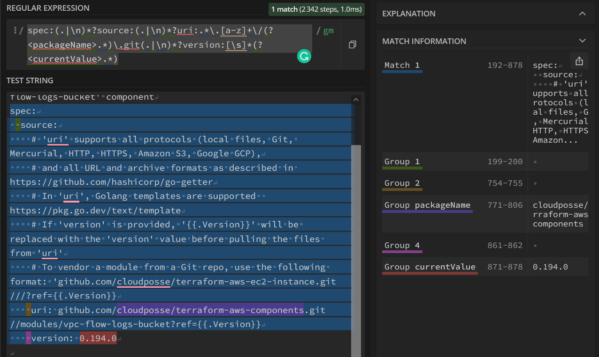

# renovate-config

These are [Shareable Config Presets](https://docs.renovatebot.com/config-presets/) for SpotOn. It contains wide-use [Renovatebot](https://github.com/renovatebot/renovate) configs, based on our toolset and mindset.

* [Usage](#usage)
* [Development notes](#development-notes)
  * [New Releases](#new-releases)
* [Useful links](#useful-links)
  * [Renovate App and presets configuration](#renovate-app-and-presets-configuration)
  * [Repos configuration](#repos-configuration)
  * [Custom check creation](#custom-check-creation)
* [Troubleshooting](#troubleshooting)

## Usage

<!-- markdownlint-disable no-inline-html -->
<details><summary>If Renovate has already been activated for repo</summary>

1. Check to see if you have a `renovate.json` already. It can be in any of these [possible locations](https://docs.renovatebot.com/getting-started/installing-onboarding/#configuration-location).
2. Change `renovate` config to:

    ```json5
    {
      "$schema": "https://docs.renovatebot.com/renovate-schema.json",
      "extends": [
        "local>SpotOnInc/renovate-config"
      ]
    }
    ```

After that, skip to step 3 below.

</details>

---

Otherwise:

1. Manually update as much as you can before moving forward. You will have the best experience with Renovate if you start with a fully-updated repo.
2. Activate [Renovatebot Github App](https://github.com/marketplace/renovate) for your repo or ask your GitHub org administrators to enable it.
3. Renovate will create an [init PR](https://docs.renovatebot.com/getting-started/installing-onboarding/#repository-onboarding) for the new repo - open it and check that it has:

    ```json5
    {
      "$schema": "https://docs.renovatebot.com/renovate-schema.json",
      "extends": [
        "local>SpotOnInc/renovate-config"
      ]
    }
    ```

4. (Optional) We recommend moving the config to `.github/renovate.json5`.
5. (Optional) If you use [`pre-commit`](https://pre-commit.com/) we recommend adding next check to repo `.pre-commit-config.yaml`:

    ```yaml
    - repo: https://github.com/pre-commit/mirrors-prettier
      rev: v3.0.0-alpha.4
      hooks:
      - id: prettier
        # https://prettier.io/docs/en/options.html#parser
        files: '.json5$'
    ```

6. Be sure that the `Dependency graph` and `Dependabot alerts` are enabled for the repo. [Details](https://docs.renovatebot.com/configuration-options/#vulnerabilityalerts).
7. Merge PR and relax. Renovate will create PRs based on provided schedules. By default, you will see Renovate PRs on Mondays.

## Development notes

To change the default config, edit [`default.template.json5`](default.template.json5) and create a PR. The matching `default.json` will be automatically [generated and added](.github/workflows/generate-renovate-config.yaml) after your PR is merged.

> **Note**: If your new `default.json` config does not apply for more than 6 hours, create test repo and copy-paste the whole `default.json` over and rename it to `renovate.json`. Renovatebot will test the configuration and create issues if it found problems with the configuration. Or you can ask ChatGPT :)

### New Releases

To create a new release, go [here](https://github.com/SpotOnInc/renovate-config/actions/workflows/release.yaml).

If there are no releases for more than 30 days and in `main` present something that is ready to be released - the release will be [automatically triggered](.github/workflows/trigger-release.yaml).

## Useful links

* [How Renovate find/create/update PRs](https://docs.renovatebot.com/key-concepts/pull-requests/)  
  TL;DR: Renovatebot checks branch names and PR titles. If PR is not found to match the branch - Renovatebot will create a new PR.  
  To recreate a closed PR, rename the closed PR.

### Renovate App and presets configuration

* [Managing config for many repositories](https://docs.renovatebot.com/key-concepts/presets/#managing-config-for-many-repositories)
* [Shareable Config Presets](https://docs.renovatebot.com/config-presets/#shareable-config-presets)
  * [Organization level presets](https://docs.renovatebot.com/config-presets/#organization-level-presets) -  `myorg/renovate-config/default.json` magic name
  * [GitHub-hosted Presets](https://docs.renovatebot.com/config-presets/#github-hosted-presets)
  * [Contributing to presets](https://docs.renovatebot.com/config-presets/#contributing-to-presets)
  * [Preset Versioning](https://docs.renovatebot.com/config-presets/#github)

* [Managers: Supported, configuration, disabling, etc.](https://docs.renovatebot.com/modules/manager/)

* [Renovate App on GitHub Secrets Encryption](https://docs.renovatebot.com/getting-started/private-packages/#mend-renovate-hosted-app-encryption)

* [Known limitations](https://docs.renovatebot.com/known-limitations/)  
  Example: GitHub hosted app Mend checks each active repository roughly every three hours, if no activity has been seen before then (merged PRs, etc).

  * [No rebasing if you have made edits](https://docs.renovatebot.com/updating-rebasing/#no-rebasing-if-you-have-made-edits) (conflicting with pre-commit auto-fixes)

* [onboardingConfigFileName](https://docs.renovatebot.com/self-hosted-configuration/#onboardingconfigfilename) (self-hosted only).  
  Useful to change onboarding Renovate config file location.

* [Docker Registries authentication](https://docs.renovatebot.com/docker/#registry-authentication)


### Repos configuration

* [Configuration location](https://docs.renovatebot.com/getting-started/installing-onboarding/#configuration-location)

* [Overriding global configs](https://docs.renovatebot.com/key-concepts/automerge/#overriding-global-automerge)

* [Scheduling syntax](https://docs.renovatebot.com/key-concepts/scheduling/#scheduling-syntax)
  * [Schedule Presets](https://docs.renovatebot.com/presets-schedule/)

* [Changing the Semantic Commit type](https://docs.renovatebot.com/semantic-commits/#changing-the-semantic-commit-type)
* [How to edit branch names, commit messages, PR titles, and PR content](https://docs.renovatebot.com/configuration-templates/)
* [Docker Digest pinning and Updating](https://docs.renovatebot.com/docker/#digest-pinning)
* [Separate `patch` and `minor` releases of dependencies into separate PRs](https://docs.renovatebot.com/presets-default/#separatepatchreleases).  
  More details [here](https://docs.renovatebot.com/faq/#separate-patch-releases-from-minor-releases)
* [Group all packages starting with `abc` together in one PR](https://docs.renovatebot.com/faq/#group-all-packages-starting-with-abc-together-in-one-pr)
* [:pinVersions](https://docs.renovatebot.com/presets-default/#pinversions) - maintain a single version only and not SemVer ranges
* [:rebaseStalePrs](https://docs.renovatebot.com/presets-default/#rebasestaleprs) - Rebase existing PRs any time the base branch has been updated.
* [Update package/GHA references in Markdown files](https://github.com/renovatebot/.github/blob/d9b3c1914f4bf9dbecc6456610ca89530260572f/default.json#L121-L140)

### Custom check creation

* [How to create a custom regex manager](https://www.cloudquery.io/how-to-guides/update-plugins-using-renovate)


1. Create a regex manager in your `renovate.json5` such as:

    ```json5
    {
      regexManagers: [
        {
          description: "",
          fileMatch: [""], // regex
          matchStrings: [
            "", // Your regex will be here
          ],
          //One of https://docs.renovatebot.com/modules/datasource/
          datasourceTemplate: "",
          packageNameTemplate: "{{packageName}}",
          // custom-prefix@ needed only in case you;d like provide some custom rules to theses packages
          depNameTemplate: "custom-prefix@{{packageName}}",
           // In case you'd like remove `v` prefix
          extractVersionTemplate: "^v?(?<version>.*)$",
          // One of https://docs.renovatebot.com/modules/versioning/, IE `semver`:
          versioningTemplate: "semver",
        },
      ],
      //// By providing `packageRules` and `matchDepPatterns` you can customize your package updates from regexManager.
      // packageRules: [
      //   {
      //     matchDepPatterns: ["^custom-prefix@"],
      //   },
      // ],
    }
    ```

    and fill all fields except `matchStrings`.

2. Find file with dependencies that you want to update and paste file content to [regex101.com](https://regex101.com)

3. Write regex for `matchStrings` which will catch:

    > **Note** Renovate uses RE2 without back and forward lookup groups support, so PCRE2 with these limitations in mind works fine

    * current package version (`<currentValue>`)
    * package source URL (`<packageName>`). What should be inside depends on `datasourceTemplate` which you will use.  
      For example, for `datasourceTemplate: "github-releases"` you need cutch to `<packageName>` `GithubPkgOrg/PkgRepo` string.

    <details><summary>Catch fields example</summary>

    

    </details>

4. Copy regex from `regex101.com` to `matchStrings` section. Replace all `\` with `\\`.

5. Test that all works as expected. It could be done by creating a temporary repo with your Renovate config and test file, with a non-latest version. Read Renovate logs, force PR creation, and check opened PR if needed.

    <details><summary>Possible Final Result</summary>

    ```json5
    {
      // For https://atmos.tools/core-concepts/components/vendoring/#schema-componentyaml
      regexManagers: [
        {
          description: "Update Atmos Vendor Components",
          fileMatch: ["component.yaml$"],
          matchStrings: [
            "spec:(.|\\n)*?source:(.|\\n)*?uri:.*\\.[a-z]+\\/(?<packageName>.*)\\.git(.|\\n)*?version:[\\s]*(?<currentValue>.*)",
          ],
          datasourceTemplate: "github-releases",
          packageNameTemplate: "{{packageName}}",
          depNameTemplate: "atmos-vendor@{{packageName}}",
          extractVersionTemplate: "^v?(?<version>.*)$",
          versioningTemplate: "semver",
        },
      ],

      packageRules: [
        {
          matchDepPatterns: ["^atmos-vendor@"],
          extends: ["schedule:monthly"],
        },
      ],
    }
    ```

## Troubleshooting

* [Troubleshooting docs](https://docs.renovatebot.com/troubleshooting/)
* [Renovate dashboard](https://developer.mend.io)
